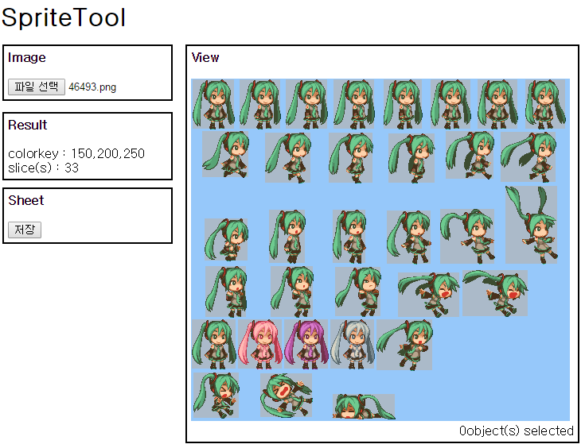
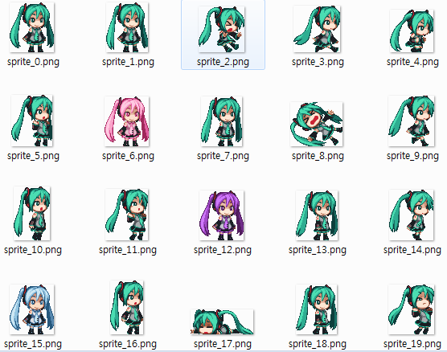

스프라이트 자르기 툴
====

[프로그램 링크](http://pjc.luavis.kr/js/sprite/tool.html)
----

기능
----
* 웹에서 줏어온 스프라이트([예시](http://www.spriters-resource.com/mobile/adventuretimeheroesofooo/sheet/64447/))를 쓰기 편하게 잘라주는 툴
* 자동으로 배경 투명화해서 PNG로 저장

예시
----

 

사용법
----
* Image탭의 __파일 선택__ 버튼을 눌러서 분리하고싶은 이미지 업로드
* 자동적으로 잘라지지만, 결과가 이상할 경우 자르고 싶은 기준 색(칼라키)에 커서를 올리고 마우스 오른쪽 버튼 클릭
* 아래 그림 처럼 원래 한 뭉치지만, 자르는 과정에서 분리된 경우 해당 영역을 드래그 해서 __'m'__키를 눌러서 병합

문제점들
----
* 너무 작은 이미지, 너무 큰 이미지에 대해 처리 안함
* 수동 넘버링
* 필요 없는 조각 지우기
